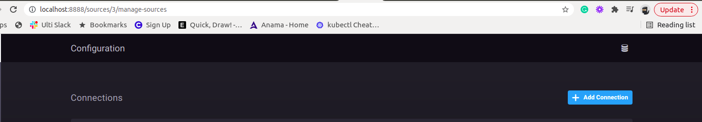
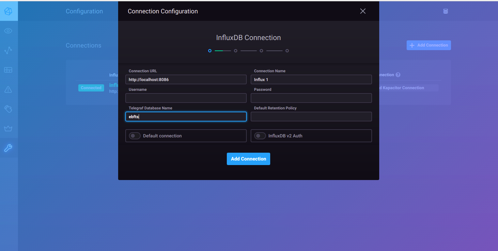
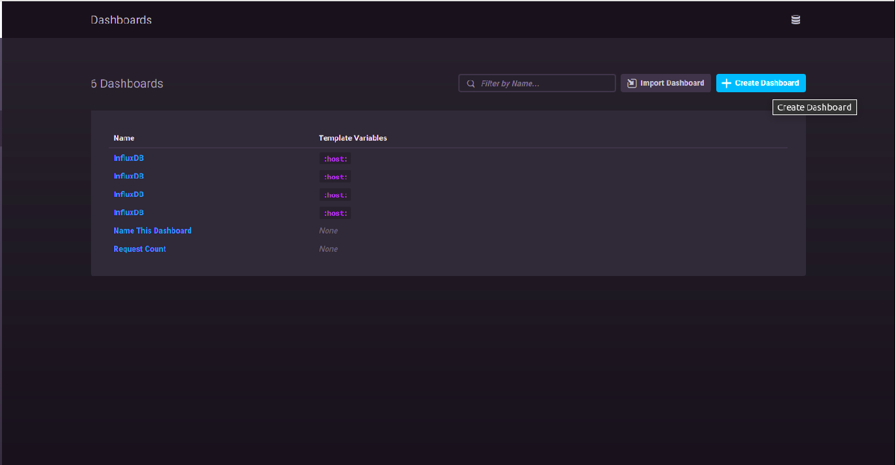
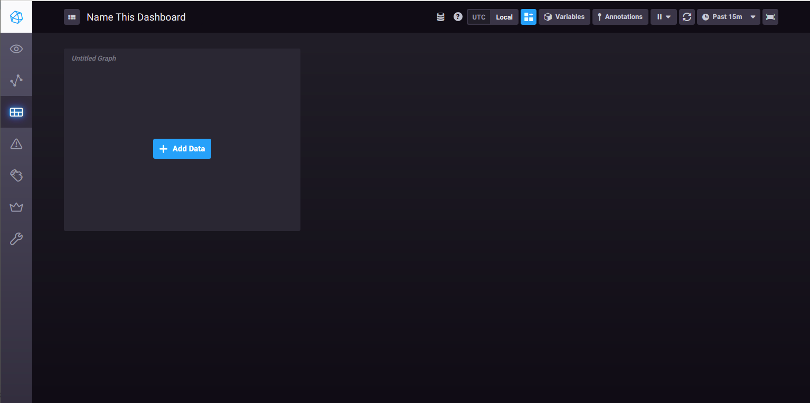
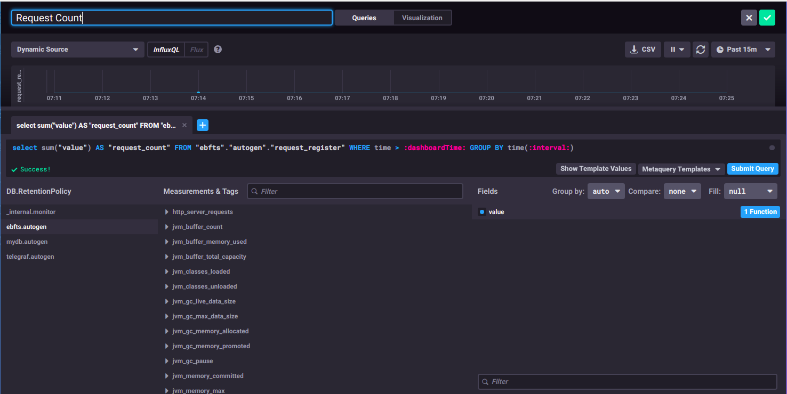
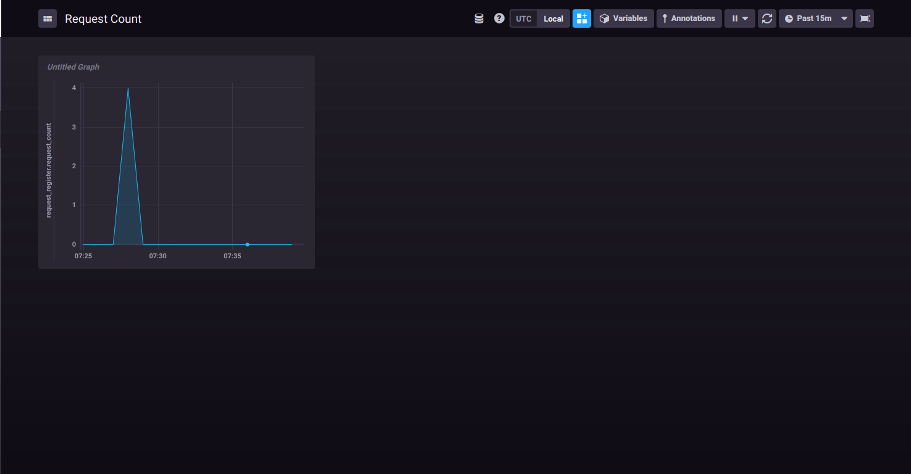
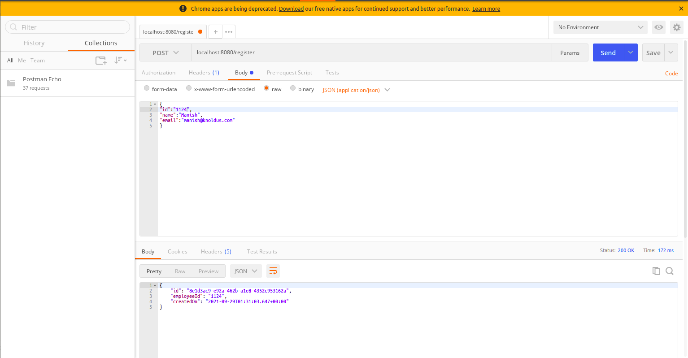

# springboot-actuator-influxdb
A complete metrics monitoring example using Spring boot and Influx DB

##How to Set Up
1. Install [Influx DB](https://docs.influxdata.com/influxdb/v1.8/introduction/install/)
2. For visualising influx metrics, install chronograf using the below instruction. You can also get it from the influx link mentioned above. 
```shell
sudo apt-get install chronograf
```
Once the above is done, the default chronograf UI should be exposed at http://localhost:8888. Open this UI. 

3. Configure Influx DB data source by clicking Add Configuration button.
       


4. Provide values inside as shown below and hit `Add Connection` button shown in the below image. Be careful with the db name (you should mention the db name which is there in `application.properties` i.e. ebfts)
   
   
5. Create dashboard by click on the dashboard button from left side buttons. Example in the image below. 
Note: If you don't find this instruction complete, please look out where dashboard is and try creating one.
   
     

6. Add dashboard data by clicking the below image  

     

7. Once you click on the above option, you can see multiple fields like query which will fetch influx data to be presented as graph. Influx db can be queried in the same as SQL. You can find the below example to add an example query to count the number of request coming to API `/register`  

     

8. After you are done adding query in the query box, you can submit query and hit the save button (In the right top corner), A graph like below will appear (except the data)  

     

9. Once everything is created, try hitting the API endpoint by running the `EbftsApplication` and hit the endpoint using the below given example: 

     

10. If you come back to the dashboard, the count of the number of request will appear depending on the time interval you are selecting (in the right top corner) and how many times you have actually hit the endpoint. 


